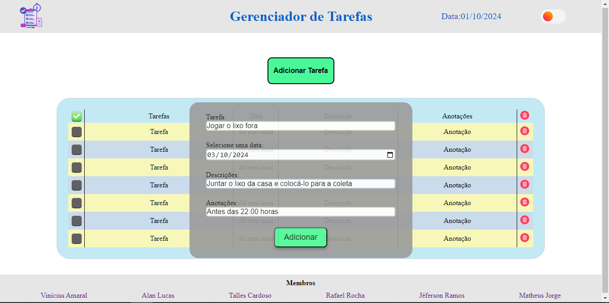
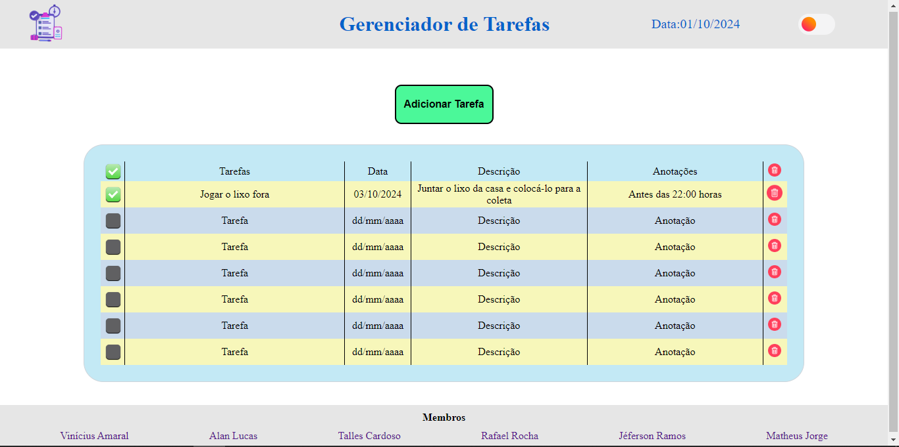

# Tarefas Em Dia
[Site](https://tarefasemdia.netlify.app/) que ajuda com a organização da suas tarefas diárias
# Softwares / Ferramentas
- Para instalar o Sass em seu computador voce pode seguir o tutorial no [site](https://sass-lang.com/install/) oficial do  Sass
- Usamos a [extensão](https://marketplace.visualstudio.com/items?itemName=ritwickdey.live-sass) do [visual studio code](https://code.visualstudio.com/download) para usar o Sass, pois é bem mais simples de instalar e usar.
# Passo a Passo para o desenvolvimento
- O Sass é uma ferramenta que auxilia o CSS, porém ainda é necessário ter a estrutura HTML.
- Configuração do Ambiente: Primeiro é fundamental a escolha de um bom editor, que voce tenha familiarida e que possua ferramentas para auxiliá-lo durante o projeto. Como o VS Code por exemplo, que foi o que escolhemos para este projeto.
- Estrutura HTML: Primeiro crie a página HTML. Essa estrutura HTML será a base do gerenciador de tarefas, contendo todo contúdo que será exibido na sua página.
- Implementação do SASS: Para implementar o SASS, você pode instalar o Sass em seu computador como explicado anteriormente ou usar a extenção Live Sass Compiler do Visual Studio Code. O Sass possui recursos adicionais para auxiliar  na criação de CSS, como variáveis, mixins, import, nesting e o extend.
- Implementação do JavaScript: Caso julgue necessário, utilize  o JavaScript em conjuto com o Sass para adicionar funcionalidades interativas ao seu site, como a funcionalidade de trocar o tema da página. 
# Resultados
- A possiblitade de trocar o tema da pagina utilizando o JavaScript em conjunto com o Sass
  
- A função de adicionar tarefas e a troca dos seus temas.
 
- A função de marcar como conlcuida e a de remover tarefa
 
